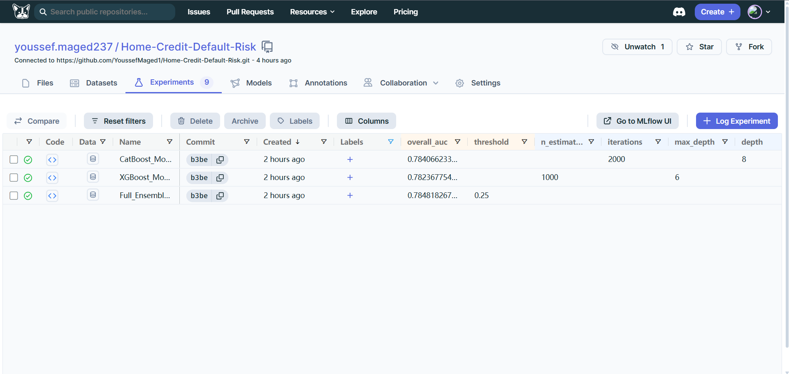
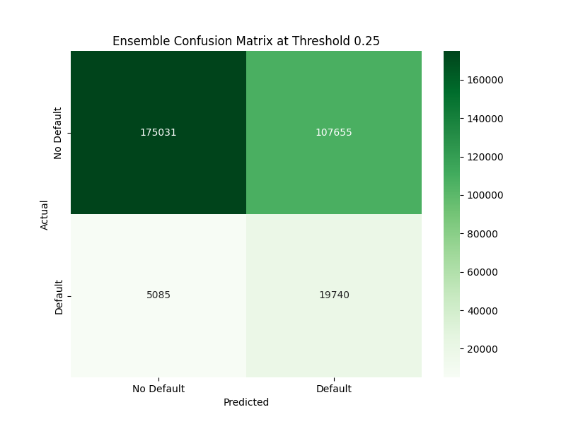
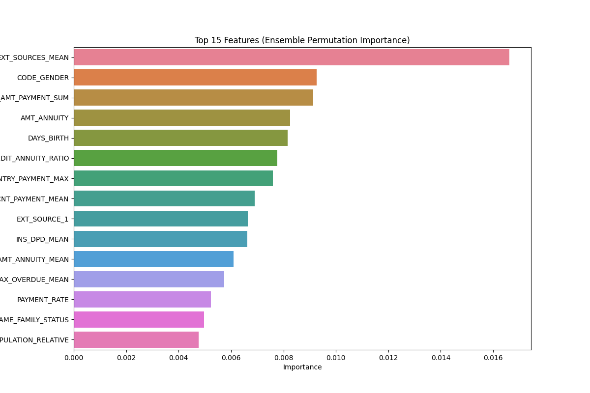
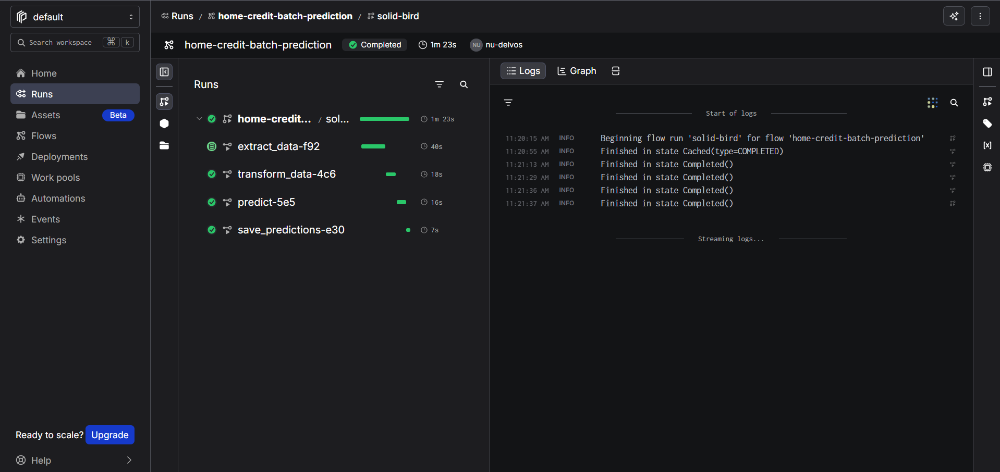
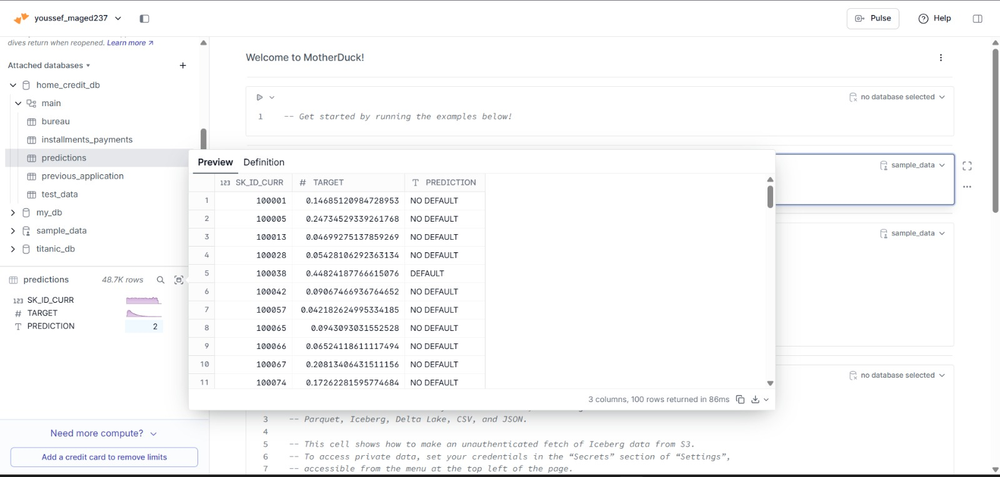
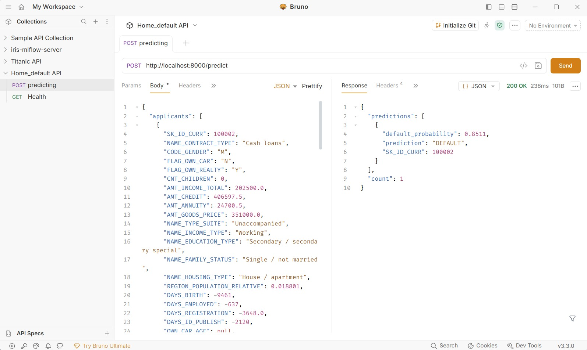

# Home Credit Default Risk

An end-to-end machine learning project for predicting loan default risk using the
Home Credit dataset. The project goes beyond model training: it includes data
versioning, feature engineering across relational tables, experiment tracking,
hyperparameter tuning, model ensembling, evaluation reports, batch prediction,
and an API serving layer.

This project was built solo as a production-style machine learning pipeline,
with the goal of showing how a data scientist can move from raw competition data
to a reproducible, trackable, and deployable credit-risk model.

## Project Highlights

- Built a full ML pipeline with `DVC`, `Hydra`, `MLflow`, `DagsHub`, and `uv`
- Engineered features from multiple Home Credit tables, not only the main
  application table
- Trained and tuned both `XGBoost` and `CatBoost`
- Used stratified K-fold validation and out-of-fold predictions
- Blended model predictions into a weighted ensemble
- Generated evaluation artifacts, including confusion matrix and feature
  importance plots
- Added batch prediction with `Prefect`, `DuckDB`, and `MotherDuck`
- Added an API serving layer with `LitServe`

## Problem

Home Credit wants to predict whether a loan applicant is likely to default. This
is a highly imbalanced binary classification problem where the positive class
represents applicants who default.

The goal is not only to achieve a strong ROC-AUC score, but also to build a
pipeline that can be reproduced, audited, and extended.

## Current Results

The final ensemble combines XGBoost and CatBoost predictions:

| Model | Validation Strategy | Metric |
| --- | --- | --- |
| XGBoost | Stratified K-Fold OOF | ROC-AUC |
| CatBoost | Stratified K-Fold OOF | ROC-AUC |
| Weighted Ensemble | OOF blend | 0.7848 ROC-AUC |

Final threshold used for classification: `0.25`

At this threshold, the model prioritizes default recall. In the current
evaluation report, recall for the default class is approximately `0.905`, which
means the model catches most risky applicants, at the cost of more false
positives.

### Experiment Tracking Snapshot

The DagsHub/MLflow experiment table shows the tracked training runs for the
CatBoost model, XGBoost model, and final ensemble. This makes the model
selection process auditable instead of depending on hidden notebook output.



### Evaluation Artifacts

The confusion matrix shows the operating behavior at the selected threshold.
Because default detection is the priority, the threshold is tuned to capture a
large share of risky applicants.



The feature importance report helps explain which input variables have the
largest impact on model predictions.



## Architecture

```text
Raw Kaggle Data
      |
      v
Data Download
      |
      v
Feature Engineering
      |
      v
Processed Train/Test Data
      |
      v
Model Training
  - XGBoost
  - CatBoost
  - Optuna tuning
  - Stratified K-Fold OOF
      |
      v
Weighted Ensemble
      |
      v
Evaluation Reports
      |
      +----------------------+
      |                      |
      v                      v
Batch Prediction        API Serving
Prefect + MotherDuck    LitServe + MLflow Models
```

## Repository Structure

```text
.
|-- conf/
|   `-- config.yaml              # Hydra configuration
|-- data/
|   |-- raw/                     # Raw competition data
|   `-- processed/               # Processed train/test datasets
|-- docs/                        # Project documentation
|-- models/                      # Model artifacts tracked by DVC
|-- reports/                     # Evaluation outputs and plots
|-- src/
|   |-- training/
|   |   |-- download_data.py     # Download data from Kaggle
|   |   |-- process_data.py      # Feature engineering and preprocessing
|   |   |-- train.py             # Training, tuning, MLflow logging
|   |   `-- evaluate.py          # Metrics and plots
|   `-- serving/
|       |-- app.py               # LitServe API
|       |-- inference.py         # Local inference helper
|       |-- predict_batch.py     # Prefect batch prediction flow
|       `-- load_to_motherduck.py
|-- dvc.yaml                     # Reproducible DVC pipeline
|-- main.py                      # CLI entrypoint
|-- pyproject.toml               # Project dependencies
`-- README.md
```

## Pipeline

The pipeline is defined in `dvc.yaml` and includes the following stages:

| Stage | Description |
| --- | --- |
| `download` | Downloads the Home Credit dataset from Kaggle |
| `process` | Builds aggregated relational features and saves processed data |
| `train` | Tunes, trains, validates, and logs XGBoost/CatBoost models |
| `evaluate` | Creates metrics, confusion matrix, and feature importance reports |
| `inference` | Generates submission predictions |

Run the full DVC-managed pipeline:

```bash
uv run main.py --mode pipeline
```

Run individual stages:

```bash
uv run main.py --mode download
uv run main.py --mode process
uv run main.py --mode train
uv run main.py --mode evaluate
```

Run the sequential non-DVC pipeline:

```bash
uv run main.py --mode all
```

## Feature Engineering

The project builds features from several Home Credit relational tables:

- `application_train.csv`
- `application_test.csv`
- `bureau.csv`
- `previous_application.csv`
- `installments_payments.csv`

Examples of engineered features:

- Credit-to-income and annuity-to-income ratios
- External source aggregations and interactions
- Bureau debt-to-credit ratio
- Previous application approval/refusal counts
- Installment payment delay and payment difference statistics
- Age, employment, income, and credit relationship features

This helps the model learn applicant behavior from historical credit activity,
not just from the current loan application.

## Modeling Approach

The final solution uses two strong gradient boosting models:

- `XGBoostClassifier`
- `CatBoostClassifier`

Both models are trained with:

- Stratified K-fold validation
- Out-of-fold prediction tracking
- Optuna hyperparameter search
- MLflow experiment logging
- Class imbalance handling through `scale_pos_weight`
- Reproducible random seeds

The final prediction is a weighted ensemble:

```text
final_probability = 0.3 * xgboost_probability + 0.7 * catboost_probability
```

The weights are configurable in `conf/config.yaml`.

## Experiment Tracking

MLflow is integrated through DagsHub. Training runs log:

- Best hyperparameters
- Static model parameters
- Fold configuration
- Ensemble weights
- ROC-AUC metrics
- Serialized sklearn-compatible model pipelines

Required environment variables:

```bash
DAGSHUB_TOKEN=your_token
DAGSHUB_USERNAME=your_username
KAGGLE_USERNAME=your_kaggle_username
KAGGLE_API_TOKEN=your_kaggle_token
MOTHERDUCK_TOKEN=your_motherduck_token
```

Use `.env.example` as the template for local configuration.

## Evaluation

The evaluation stage produces:

- `reports/final_summary.json`
- `reports/confusion_matrix.png`
- `reports/feature_importance.png`

The project uses ROC-AUC as the main ranking metric, which fits the original
Home Credit competition objective. Classification metrics are also generated at
the configured threshold to understand operational behavior.

## Batch Prediction

Batch prediction is implemented with `Prefect`, `DuckDB`, and `MotherDuck`.

The flow:

1. Extracts test and relational data from MotherDuck
2. Rebuilds the same feature set used during training
3. Loads production models from MLflow
4. Generates ensemble default probabilities
5. Writes predictions back to MotherDuck

Entry point:

```bash
uv run python -m src.serving.predict_batch
```

The Prefect run below shows the batch prediction workflow completing
successfully across extraction, transformation, prediction, and persistence
tasks.



Predictions are written back to MotherDuck so downstream tools can query the
latest default probabilities and labels.



## API Serving

The serving layer uses `LitServe` and loads production models from the MLflow
Model Registry.

Start the API:

```bash
uv run python -m src.serving.app
```

Default endpoint:

```text
POST /predict
```

Example response:

```json
{
  "predictions": [
    {
      "SK_ID_CURR": 100001,
      "default_probability": 0.1842,
      "prediction": "NO DEFAULT"
    }
  ],
  "count": 1
}
```

The API can score an applicant through a `POST /predict` request and return both
the default probability and the final threshold-based label.



## Reproducibility

This project uses:

- `uv` for dependency management
- `Hydra` for configuration
- `DVC` for pipeline orchestration and artifact tracking
- `MLflow` for experiment and model tracking
- `GitHub Actions` for linting, Docker image builds, and deployment
- `.env.example` for required secrets

Install dependencies:

```bash
uv sync
```

Download data:

```bash
uv run main.py --mode download
```

Run the full pipeline:

```bash
dvc repro
```

## Docker

The project includes a `Dockerfile` so the environment can be reproduced in CI/CD
or deployed as a containerized prediction service.

The API image expects the processed feature files used at serving time:

- `data/processed/bureau_features.csv`
- `data/processed/prev_features.csv`
- `data/processed/installments_features.csv`

These files are versioned with DVC. Pull them before building locally:

```bash
uv run dvc pull
```

Build the image:

```bash
docker build -t home-credit-default-risk .
```

Run the API service:

```bash
docker run --rm -p 8000:8000 --env-file .env home-credit-default-risk
```

The default container command starts the LitServe API:

```bash
uv run python -m src.serving.app
```

For pipeline jobs, override the container command:

```bash
docker run --rm --env-file .env home-credit-default-risk uv run main.py --mode evaluate
```

The `.dockerignore` file excludes local data, model artifacts, virtual
environments, logs, secrets, and CatBoost training output so the image stays
smaller and safer for CI/CD.

## CI/CD

GitHub Actions runs the CI/CD workflow in `.github/workflows/ci-cd.yml`.

On pull requests to `main`, the workflow runs lint and format checks with
`ruff`.

On pushes to `main`, the workflow:

1. Runs lint and format checks
2. Configures the DVC remote on DagsHub
3. Pulls DVC-tracked serving data
4. Builds and pushes the Docker image to Docker Hub
5. Deploys the pushed image to Lightning AI

Required GitHub repository secrets:

```text
DAGSHUB_USERNAME
DAGSHUB_TOKEN
DOCKERHUB_USERNAME
DOCKERHUB_TOKEN
LIGHTNING_USERNAME
LIGHTNING_API_KEY
TEAMSPACE
```

The pushed Docker image is tagged with both the short commit SHA and `latest`.

## Configuration

Most important settings live in `conf/config.yaml`:

- Data paths
- Number of folds
- Random seed
- Optuna trial count
- XGBoost search space
- CatBoost search space
- Model weights
- Classification threshold
- Artifact paths

The current configuration is GPU-oriented:

```yaml
xgboost:
  static_params:
    device: "cuda"

catboost:
  static_params:
    task_type: "GPU"
```

For CPU-only environments, change these settings before training.

## What I Would Improve Next

- Add automated unit tests for feature engineering functions
- Add schema validation for raw and processed datasets
- Add calibration analysis for predicted probabilities
- Add model explainability reports using SHAP
- Add pipeline smoke tests to CI
- Compare against a simple baseline model to show lift from feature engineering

## Why This Project Matters

This project demonstrates more than model accuracy. It shows the full lifecycle
of a machine learning system:

- Understanding a business risk problem
- Building features from relational data
- Handling class imbalance
- Training strong supervised models
- Validating with out-of-fold predictions
- Tracking experiments
- Versioning pipelines and artifacts
- Producing evaluation reports
- Serving predictions through both batch and API workflows
